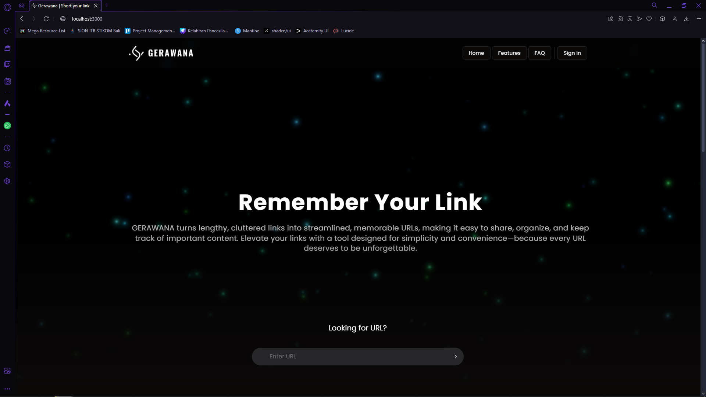
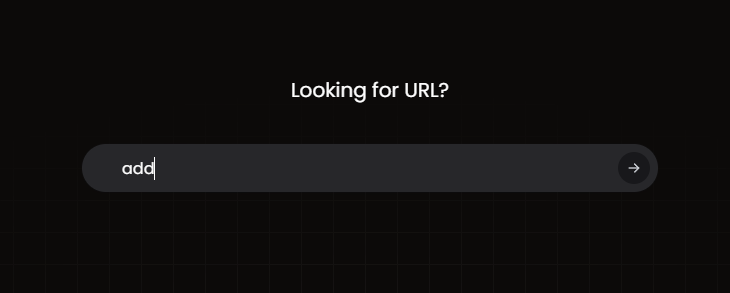
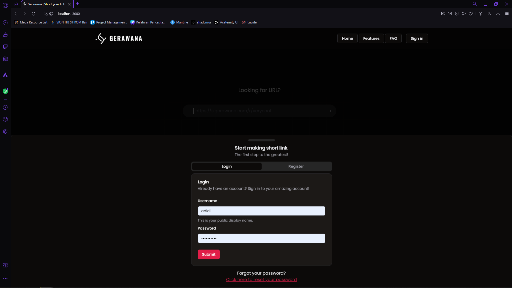
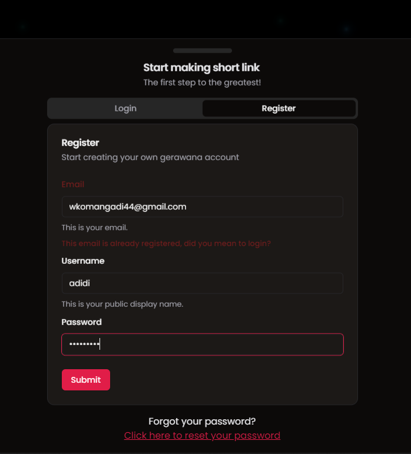
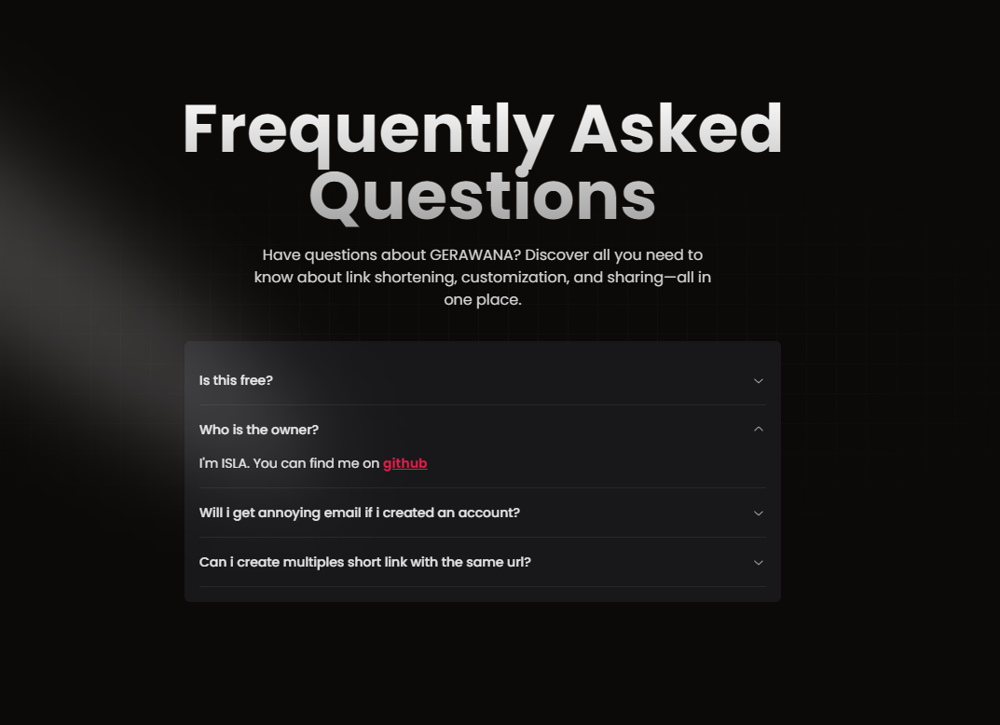
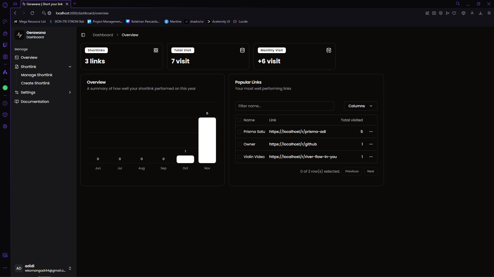
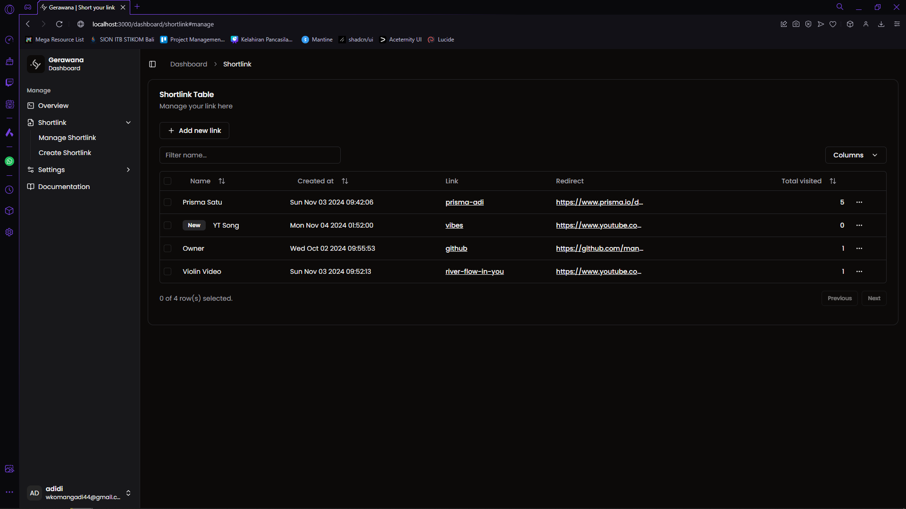
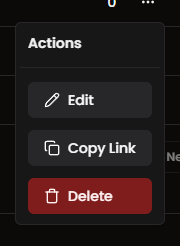
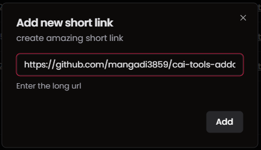
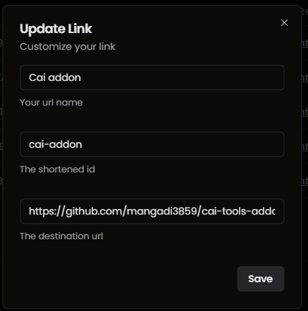

<div align="center">
    
    <h1>Gerawana Url Shortener</h1>
</div>

Author: **ISLA** (mangadi3859) (240040016)

## What is this?

This is a services based website to shortened a long link with just a few characters. We provide fully customize url with visit tracker.

## Want to run it yourself?

You need a few pre-requisites to run this website.

-   NodeJS
-   PNPM or NPM
-   MySQL Server (you can use other databases)
-   SMTP Mailing service (this is optional but you won't be getting email for reset password OTP)
-   Your own domain (this is related to SMTP)

`.env` setup

```yaml
# MYSQL
DATABASE_URL="mysql://user:@host:port/dbname"

# https://mailtrap.io this is what i use
MAIL_HOST=""
MAIL_PORT=
MAIL_USER=""
MAIL_PASS=""
```

## Table of Contents

-   [About](#what-is-this)
-   [Table of Contens](#table-of-contents)
-   [Routes](#accessible-routes)
-   [Documentation](#documentation)
    -   [Home Page](#home-page)
    -   [Dashboard Overview](#dashbord-overview)
    -   [Dashboard Shortlink](#dashboard-shortlink)
    -   [Using Shortlink](#using-shortlink)

## Accessible Routes

```
root
├───/api
│   ├───/login          :POST
│   ├───/logout         :GET
│   ├───/register       :POST
│   ├───/reset-password
│   │   ├───/new        :POST
│   │   ├───/otp        :POST
│   │   └───/save       :POST
│   ├───/settings
│   │   └───/user
│   │       └───/edit   :POST
│   └───/short
│       ├───/create     :POST
│       ├───/delete     :POST
│       ├───/edit       :POST
│       └───/overview   :GET
│
│
├───/dashboard
│   ├───/overview
│   │
│   ├───/settings
│   │   └───/user
│   │
│   └───/shortlink
│
├───/r
│   └───/[:id]
└───/reset-password

```

## Documentation

### Home Page

-   There are 4 main menus on the navbar with 5 for logged in person.
    

-   Form when you click it, will prompt you to logged in. otherwise will redirect you to `/dashboard/short`
    

-   Form login and register to start making some short urls
    
    

-   Collapsable Frequently Asked Questions
    

### Dashbord Overview

Everything onwards can only be accessed once someone logged in into an account.

-   In this page you get an overview of how much links do you have and how it perfomed on the last 6 months with a bar graph.
    

### Dashboard Shortlink

-   Manage your link here.
-   Name, Total visited, and createdAt can be used to sort the table.
-   Action buttons provided for each row to `Edit`, `Delete`, and `Copy Link` the row
    
    

-   Add new link
-   You click `Add new link` button start adding more link to your dashboard. You will be prompted to input a `Absolute Url`.
-   After that you will be get a new short link with random shortLink and Name that you can later change with `Edit` button action.
    

-   Multiples short links with the same redirect url is not allowed.
    

### Using Shortlink

-   To start using shortlink you can copy the link from previous [section](#dashboard-shortlink)
-   the link struture:

    ```
    https?://[host|localhost]:[port]/r/[link]   => http://localhost:3000/r/violin
                        With Custom Domain      => https://islacomp.my.id/r/violin
    ```

-   If `link` didn't exist on the server, you will be redirected to `/` instead.
-   Each visit will add one visited count to your link and will affect your stats on `Overview Page`
